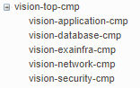
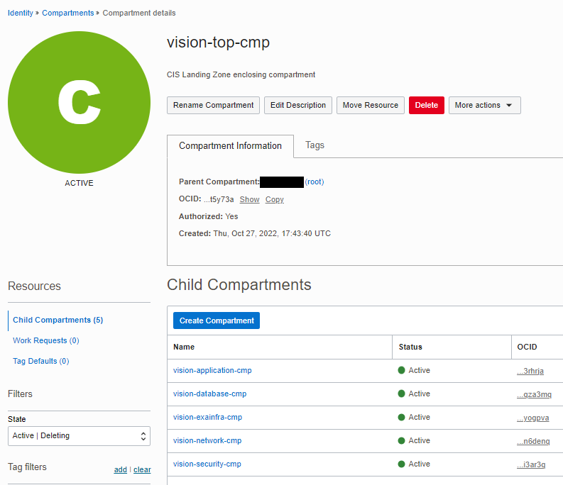

# OCI Compartments Module Usage Example - CIS Landing Zone

## Introduction

This example shows how to deploy CIS Landing Zone Quick Start compartments in Oracle Cloud Infrastructure.

It creates the compartment topology as shown in the picture below:



The same structure as shown in Compartments service console:



## Using this example
* Prepare one variable file named `terraform.tfvars` with the required IAM information. The contents of `terraform.tfvars` should look something like the following (or copy and re-use the contents of `terraform.tfvars.template`:

```
### TENANCY DETAILS
#
# Get this from OCI Console (after logging in, go to top-right-most menu item and click option "Tenancy: <your tenancy name>").
tenancy_id="<tenancy OCID>"
#
# Get this from OCI Console (after logging in, go to top-right-most menu item and click option "My profile").
user_id="<user OCID>"
#
# The fingerprint can be gathered from your user account. In the "My profile page, click "API keys" on the menu in left hand side).
fingerprint="<PEM key fingerprint>"
#
# This is the full path on your local system to the private key used for the API signing key pair.
private_key_path="<path to the private key that matches the fingerprint above>"
#
# This is the password that protects the private key, if any.
private_key_password=""
#
# This is your tenancy home region.
home_region="<your tenancy home region>"
```

Check the provided `input.auto.tfvars` file. It has a single map variable named *compartments*. 

**Caution**: Within the map, each object is identified by a key (in uppercase), like *TOP-CMP*, *NETWORK-CMP*, *SECURITY-CMP*, etc. These can actually be any strings, but once defined they MUST NOT be changed, or Terraform will try to recreate the compartments upon *terraform apply*.

Also notice *parent_id : "\<ENTER THE OCID OF THE PARENT COMPARTMENT\>"* in *TOP-CMP* object. It tells the module the existing compartment where *TOP-CMP* is attached to. 

Last, but not least, notice the *freeform_tags* applied to each compartment. They are not required, but if defined they are leveraged by [OCI CIS Landing Zone Policy Module](https://github.com/andrecorreaneto/terraform-oci-cis-landing-zone-policies) for deploying template (pre-configured) policies.

```
compartments = { 
  TOP-CMP : { 
    name : "vision-top-cmp", 
    description : "CIS Landing Zone enclosing compartment", 
    #parent_id : "<ENTER THE OCID OF THE PARENT COMPARTMENT>",
    parent_id : "ocid1.compartment.oc1..aaaaaaaa4xzo6svc5zoclp3syjwluimamqsgulurpvsdankhamussi675zla" 
    defined_tags : null, 
    freeform_tags : {
      "cislz":"vision",
      "cislz-cmp-type":"enclosing",
      "cislz-consumer-groups-security":"vision-security-admin-group",
      "cislz-consumer-groups-application":"vision-app-admin-group",
      "cislz-consumer-groups-iam":"vision-iam-admin-group"
    },
    children : {
      NETWORK-CMP : { 
        name : "vision-network-cmp", 
        description : "CIS Landing Zone Network compartment", 
        defined_tags : null, 
        freeform_tags : {
          "cislz":"vision",
          "cislz-cmp-type":"network",
          "cislz-consumer-groups-security":"vision-security-admin-group",
          "cislz-consumer-groups-application":"vision-app-admin-group",
          "cislz-consumer-groups-database":"vision-database-admin-group",
          "cislz-consumer-groups-network":"vision-network-admin-group",
          "cislz-consumer-groups-storage":"vision-storage-admin-group",
          "cislz-consumer-groups-exainfra":"vision-exainfra-admin-group"
        }, 
        children : {}
      },
      SECURITY-CMP : { 
        name : "vision-security-cmp", 
        description : "CIS Landing Zone Security compartment", 
        defined_tags : null, 
        freeform_tags : {
          "cislz":"vision",
          "cislz-cmp-type":"security",
          "cislz-consumer-groups-security":"vision-security-admin-group",
          "cislz-consumer-groups-application":"vision-app-admin-group,vision-db-admin-group",
          "cislz-consumer-groups-database":"vision-database-admin-group",
          "cislz-consumer-groups-network":"vision-network-admin-group",
          "cislz-consumer-groups-storage":"vision-storage-admin-group",
          "cislz-consumer-groups-exainfra":"vision-exainfra-admin-group"
        },
        children : {}
      },
      APP-CMP : { 
        name : "vision-application-cmp", 
        description : "CIS Landing Zone Application compartment", 
        defined_tags : null, 
        freeform_tags : {
          "cislz":"vision",
          "cislz-cmp-type":"application",
          "cislz-consumer-groups-security":"vision-security-admin-group",
          "cislz-consumer-groups-application":"vision-app-admin-group",
          "cislz-consumer-groups-database":"vision-database-admin-group",
          "cislz-consumer-groups-network":"vision-network-admin-group",
          "cislz-consumer-groups-storage":"vision-storage-admin-group",
          "cislz-consumer-groups-exainfra":"vision-exainfra-admin-group"
        },
        children : {}
      },
      DB-CMP : { 
        name : "vision-database-cmp", 
        description : "CIS Landing Zone Database compartment", 
        defined_tags : null, 
        freeform_tags : {
          "cislz":"vision",
          "cislz-cmp-type":"database",
          "cislz-consumer-groups-security":"vision-security-admin-group",
          "cislz-consumer-groups-application":"vision-app-admin-group",
          "cislz-consumer-groups-database":"vision-database-admin-group",
          "cislz-consumer-groups-network":"vision-network-admin-group",
          "cislz-consumer-groups-storage":"vision-storage-admin-group",
          "cislz-consumer-groups-exainfra":"vision-exainfra-admin-group"
        },
        children : {}
      },
      EXACS-CMP : { 
        name : "vision-exainfra-cmp", 
        description : "CIS Landing Zone Exadata Cloud Service compartment",  
        defined_tags : null, 
        freeform_tags : {
          "cislz":"vision",
          "cislz-cmp-type":"exainfra",
          "cislz-consumer-groups-security":"vision-security-admin-group",
          "cislz-consumer-groups-application":"vision-app-admin-group",
          "cislz-consumer-groups-database":"vision-database-admin-group",
          "cislz-consumer-groups-network":"vision-network-admin-group",
          "cislz-consumer-groups-storage":"vision-storage-admin-group",
          "cislz-consumer-groups-exainfra":"vision-exainfra-admin-group"
        },
        children : {}
      } 
    }
  }
}  
```

Check the provided main.tf file. It calls the underlying tags module for resource management. 

*enable_compartments_delete = true* assignment makes OCI physically deleting all managed compartments upon *terraform destroy*.

`main.tf`:

```
module "cislz_compartments" {
  source = "../../"
  compartments = var.compartments
  enable_compartments_delete = true
}
```

Then execute the example using the usual Terraform workflow:

```
$ terraform init
$ terraform plan
$ terraform apply
```